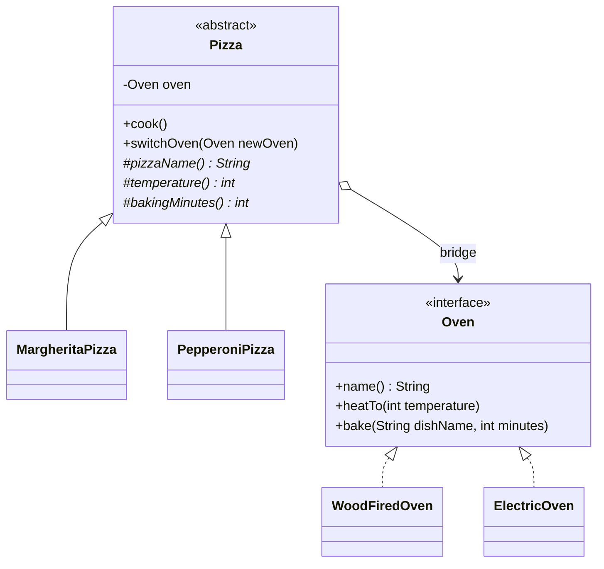

# Pizza Bakery — Bridge Pattern (Java)

Assignment #3 · Software Design Patterns · Bridge

A pizza bakery where **what to bake** (Margherita, Pepperoni) is separated from
**how to bake it** (wood-fired oven, electric oven). A pizza only knows the
temperature and time it needs; an oven only knows how to heat and bake. The two
sides are connected by one reference (the "bridge") and can change independently.

## How to run

Requires JDK 17+.

```bash
mkdir out
javac -d out $(find src -name '*.java')
java -cp out pizza.Main
```

Windows PowerShell:

```powershell
mkdir out
javac -d out (Get-ChildItem -Recurse src -Filter *.java).FullName
java -cp out pizza.Main
```

Or simply run `Main` from IntelliJ IDEA.

### Expected output

```
Cooking Margherita in Wood Fired Oven
    [wood] Adding logs, fire is heating up to 450°C
    [wood] Baking Margherita on open fire for 7 min
Cooking Margherita in Electric oven
    [electric] Heating elements are on, target 450°C
    [electric] Baking Margherita with even heat for 7 min
Cooking Pepperoni in Electric oven
    [electric] Heating elements are on, target 220°C
    [electric] Baking Pepperoni with even heat for 12 min
```

The first two blocks are the **same** `Margherita` object: its oven was switched
at runtime with `switchOven(...)`, and the pizza class did not change.

## Project structure

```
src/pizza
├── Main.java                    <- Client
├── abstraction/
│   ├── Pizza.java               <- Abstraction
│   ├── MargheritaPizza.java     <- Refined Abstraction #1
│   └── PepperoniPizza.java      <- Refined Abstraction #2
└── implementor/
    ├── Oven.java                <- Implementor (interface)
    ├── WoodFiredOven.java       <- Concrete Implementor #1
    └── ElectricOven.java        <- Concrete Implementor #2
```

## Pattern roles

| Component | Requirement | Implementation |
| --- | --- | --- |
| Abstraction | Abstract class holding a reference to an Implementor | `Pizza` (field `oven`) |
| Refined Abstraction | At least two subclasses | `MargheritaPizza`, `PepperoniPizza` |
| Implementor | Interface with low-level operations | `Oven` (`name`, `heatTo`, `bake`) |
| Concrete Implementor | At least two implementations | `WoodFiredOven`, `ElectricOven` |
| Client | Composes at runtime and switches implementation | `Main` (`new MargheritaPizza(new WoodFiredOven())`, `switchOven(new ElectricOven())`) |

## UML



## Clean Code principles applied

1. **Separation of abstraction-side and implementation-side responsibilities.**
   `Pizza` decides *what* is needed (`temperature()`, `bakingMinutes()`); `Oven`
   decides *how* it is done (`heatTo`, `bake`). `Pizza` never contains oven-specific
   code, and the ovens never contain pizza-specific code. `Main` does not call
   `heatTo` or `bake` directly, so no implementor details leak to the client.

2. **Meaningful names that show the role.** `Pizza`, `MargheritaPizza`,
   `PepperoniPizza` are on the abstraction side; `Oven`, `WoodFiredOven`,
   `ElectricOven` are on the implementor side. Packages `abstraction` and
   `implementor` repeat the same split, and each class has a comment with its
   pattern role.

3. **Small, focused classes.** Every class has one reason to change. A pizza
   class only describes one recipe's parameters (name, temperature, time); an oven
   class only describes one way of heating. Every method is a few lines long.

4. **No duplicated logic.** The baking workflow (print, heat, bake) is written
   once in `Pizza.cook()` and reused by every pizza. The two ovens share no
   copy-pasted code: each contains only its own behaviour.

5. **Open/Closed principle — backward-compatible design.** A new oven (for example
   `GasOven implements Oven`) or a new pizza (for example `QuattroFormaggiPizza
   extends Pizza`) can be added without changing any existing class on either side
   of the bridge.

6. **Program to an interface (Dependency Inversion).** `Pizza` depends on the
   `Oven` interface and never on `WoodFiredOven` or `ElectricOven`. The concrete
   oven is chosen only in the client.

7. **Fail fast.** The constructor and `switchOven` use `Objects.requireNonNull`,
   so a pizza can never end up without an oven, and the error appears immediately
   at the place where it was made.

8. **Composition over inheritance.** Instead of one subclass per combination
   (`MargheritaWoodFired`, `MargheritaElectric`, ...), pizzas and ovens are
   separate hierarchies connected by a field. With 2 pizzas and 2 ovens the number
   of classes is the same (4), but with 3 pizzas and 3 ovens it is 6 instead of 9,
   and the gap grows with every new variant.
